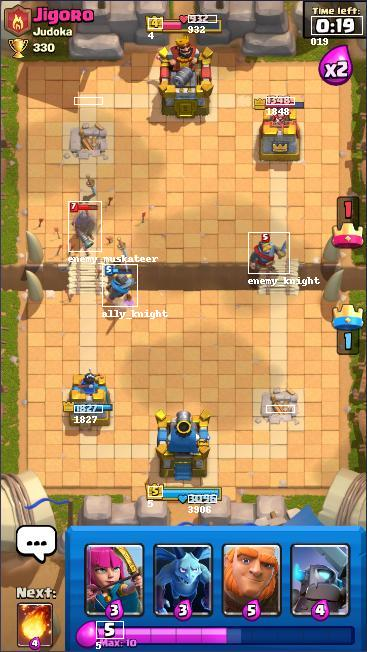

# Clash Royale Build-A-Bot

Build your own bot to play Clash Royale.



## Description

Open-source tools for creating Clash Royale bots are poor, 
largely due to the way they process the screen to generate a state.

Most repositories are missing data, or return incorrect data from the screen.

We present an advanced state generator, which is accurate and returns a lot of information.

For example, the image above returns the following:
```
{'cards': [{'cost': 4,
            'name': 'fireball',
            'target': 'air/ground',
            'type': 'spell'},
           {'cost': 3,
            'name': 'archers',
            'target': 'air/ground',
            'type': 'troop'},
           {'cost': 3,
            'name': 'minions',
            'target': 'air/ground',
            'type': 'troop'},
           {'cost': 5, 'name': 
            'giant', 
            'target': 'buildings', 
            'type': 'troop'},
           {'cost': 4,
            'name': 'minipekka',
            'target': 'ground',
            'type': 'troop'}],
 'hp': {'ally_king': {'bounding_box': (188, 495, 216, 502),
                      'confidence': [0.8540307879447937, 0.2880464792251587,
                                     0.861870527267456, 0.7974210381507874],
                      'hp': '3906'},
        'enemy_king': {'bounding_box': (188, 15, 216, 22),
                       'confidence': [0.9030442237854004, 0.8697320818901062,
                                      0.8196498155593872],
                       'hp': '932'},
        'left_ally_princess': {'bounding_box': (74, 405, 102, 412),
                               'confidence': [0.7639173269271851,
                                              0.8436545729637146,
                                              0.8957383632659912,
                                              0.8154789805412292],
                               'hp': '1827'},
        'left_enemy_princess': {'bounding_box': (74, 97, 102, 104),
                                'confidence': [],
                                'hp': ''},
        'right_ally_princess': {'bounding_box': (266, 405, 294, 412),
                                'confidence': [],
                                'hp': ''},
        'right_enemy_princess': {'bounding_box': (266, 97, 294, 104),
                                 'confidence': [0.6561276316642761,
                                                0.4170827567577362,
                                                0.8278769254684448,
                                                0.8458866477012634],
                                 'hp': '1848'}},
 'numbers': {'ally_king_level': {'bounding_box': (148, 486, 162, 496),
                                 'number': '5'},
             'elixir': {'bounding_box': (96, 621, 123, 638), 
                        'number': '5'},
             'enemy_king_level': {'bounding_box': (148, 18, 162, 28),
                                  'number': '4'},
             'timer': {'bounding_box': (311, 16, 362, 34), 
                       'number': '019'}},
 'units': {'ally_knight': [{'bounding_box': [102, 264, 137, 306],
                            'confidence': 0.9561323}],
           'enemy_knight': [{'bounding_box': [248, 232, 289, 273],
                             'confidence': 0.9614041}],
           'enemy_muskateer': [{'bounding_box': [68, 201, 101, 251],
                                'confidence': 0.9313083}]}}
```

With a more powerful interpretation of the state,
we can start to build bots that can make intelligent decisions.

## Getting Started

* [Setup](https://github.com/Pbatch/ClashRoyaleBuildABot/wiki/Setup) your environment and the emulator.

* [Try](https://github.com/Pbatch/ClashRoyaleBuildABot/wiki/Tutorial-(Basic)) the basic tutorial.

