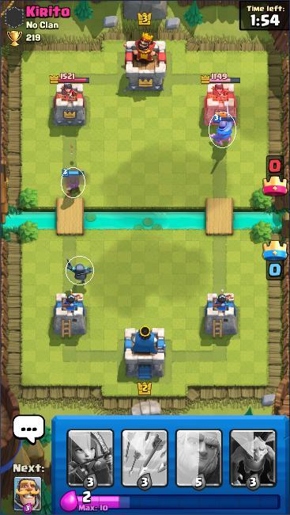

# Clash Royale Build-A-Bot

Build your own bot to play Clash Royale.


```
{'ally_crowns': 0,
 'ally_hp': 2568,
 'ally_level': 2,
 'cards': [{'cost': 3, 'name': 'knight'},
           {'cost': 3, 'name': 'archers'},
           {'cost': 3, 'name': 'arrows'},
           {'cost': 5, 'name': 'giant'},
           {'cost': 3, 'name': 'minions'}],
 'elixir': 2,
 'enemy_crowns': 0,
 'enemy_hp': 2736,
 'enemy_level': 3,
 'left_ally_princess': 1512,
 'left_enemy_princess': 1521,
 'right_ally_princess': 1512,
 'right_enemy_princess': 1749,
 'timer': 114,
 'unit_positions': [{'bounding_box': [264.4919738769531,
                                      141.7902069091797,
                                      298.5768127441406,
                                      186.51193237304688],
                     'confidence': 0.87863845,
                     'unit': 'ally_knight'},
                    {'bounding_box': [77.82494354248047,
                                      211.29742431640625,
                                      107.518798828125,
                                      249.88050842285156],
                     'confidence': 0.8610656,
                     'unit': 'ally_musketeer'},
                    {'bounding_box': [83.25800323486328,
                                      323.7983093261719,
                                      118.34205627441406,
                                      359.67144775390625],
                     'confidence': 0.8543022,
                     'unit': 'ally_minipekka'}]}
```

## Setup

Clone the repository and install the requirements
```
>>> git clone https://github.com/Pbatch/ClashRoyaleBuildABot.git
>>> cd ClashRoyaleBuildABot
>>> pip install -r requirements.txt
```

Download the BlueStacks emulator (https://www.bluestacks.com/download.html). 

## Tutorial

This is a simple tutorial for building your own bot.

1.) Create a subclass of Bot (`src/bot/bot.py`).

* Bot methods

    The Bot class has 3 important class methods.
    
    `get_state()` - Retrieve the current state of the game.
    
    `get_actions(state)` - Calculate the playable actions for the given state.
    
    `play_action(action)` - Play the given action.

* Bot arguments

    The only argument for the Bot class is a list of the names of the cards in your deck.
     
     The starting deck is
    `    card_names = ['minions', 'archers', 'arrows', 'giant',
                      'minipekka', 'fireball', 'knight', 'musketeer']`.


2.) Program your bot to repeatedly play an available action.

I.e. RandomBot (`src/bot/random_bot.py`) chooses an action at random every 5 seconds.

```
from src.bot.bot import Bot
import random
import time

class RandomBot(Bot):
    def run(self):
        while True:
            state = self.get_state()
            actions = self.get_actions(state)
            if actions:
                action = random.choice(actions)
                self.play_action(action)
                print(f'Playing {state["cards"][action[0] + 1]["name"]} at tile ({action[1]}, {action[2]})')
            time.sleep(5)
```

3.) Load the emulator, start a game, and watch your bot play! I.e.

```
from src.bot.random_bot import RandomBot

card_names = ['minions', 'archers', 'arrows', 'giant',
              'minipekka', 'fireball', 'knight', 'musketeer']
bot = RandomBot(card_names)
bot.run()
```

## Limitations

* The model to detect units on the battlefield needs more labelled examples.
* The state does not include the levels of each unit or their hp.

