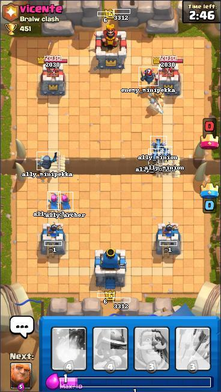

# Clash Royale Build-A-Bot
<!-- ALL-CONTRIBUTORS-BADGE:START - Do not remove or modify this section -->

<!-- ALL-CONTRIBUTORS-BADGE:END -->

Build your own bot to play Clash Royale (Windows only).

## Description

We present an advanced state generator, which is accurate and returns a lot of information.
It uses:
* YOLOv5 to infer the units and numbers
* Image hashes to detect the cards
* A simple function of the pixels to deduce the elixir

With a more powerful interpretation of the state,
we can start to build bots that can make intelligent decisions.

## Getting Started

* [Setup](https://github.com/Pbatch/ClashRoyaleBuildABot/wiki/Setup) your environment and the emulator.

* [Try](https://github.com/Pbatch/ClashRoyaleBuildABot/wiki/Tutorial-(Basic)) the basic bot building tutorial.

* [Learn](https://github.com/Pbatch/ClashRoyaleBuildABot/wiki/State) how the state is generated.

## Contributors ✨

Thanks goes to these wonderful people ([emoji key](https://allcontributors.org/docs/en/emoji-key)):

<!-- ALL-CONTRIBUTORS-LIST:START - Do not remove or modify this section -->
<!-- prettier-ignore-start -->
<!-- markdownlint-disable -->
<table>
  <tr>
    <td align="center"><a href="https://github.com/link-discord"> <b>Link</b></a> <a href="#data-link-discord" title="Data">🔣</a></td>
    <td align="center"><a href="http://www.pazder.ca"> <b>Emgimeer-Bazder</b></a> <a href="https://github.com/Pbatch/ClashRoyaleBuildABot/issues?q=author%3AEmgimeer-Bazder" title="Bug reports">🐛</a></td>
    <td align="center"><a href="https://github.com/GavriloviciEduard"> <b>Gavrilovici Eduard</b></a> <a href="https://github.com/Pbatch/ClashRoyaleBuildABot/commits?author=GavriloviciEduard" title="Documentation">📖</a></td>
  </tr>
</table>

<!-- markdownlint-restore -->
<!-- prettier-ignore-end -->

<!-- ALL-CONTRIBUTORS-LIST:END -->

This project follows the [all-contributors](https://github.com/all-contributors/all-contributors) specification. Contributions of any kind welcome!